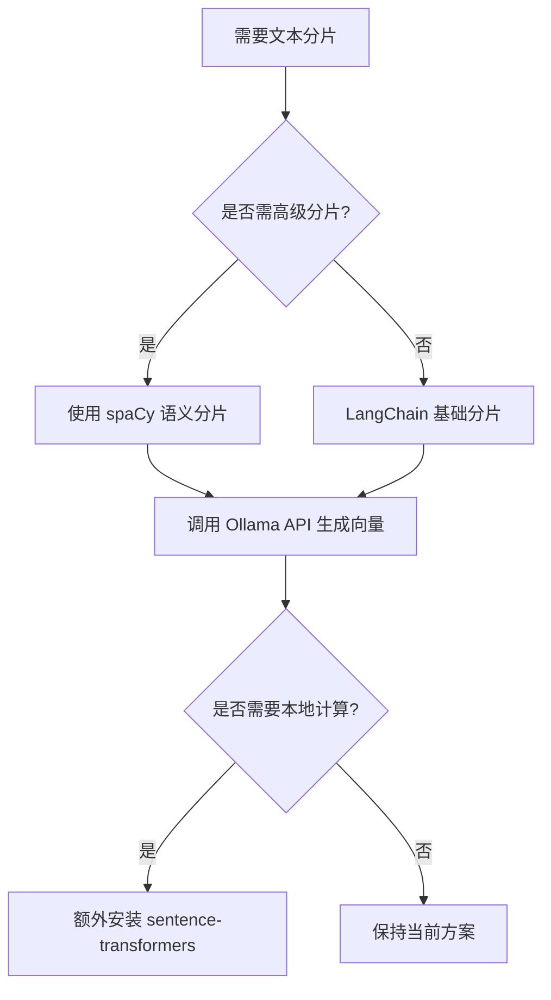
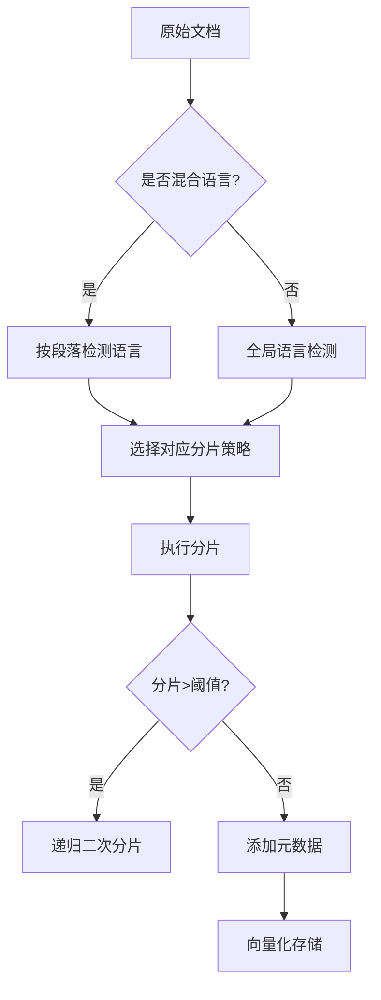

# 设计RAG项目中的父子分片方案

在开发检索增强生成(RAG)项目时，设计有效的父子分片方案对于提高检索质量和系统性能至关重要。以下是一个全面的设计方案：

## 1. 理解父子分片概念

**父分片**：较大的内容块，包含较完整的语义信息
**子分片**：从父分片细分出的较小单元，便于精准检索

## 2. 分片设计原则

### 分片大小策略
- 父分片：500-1000个字符（或根据文档结构）
- 子分片：100-300个字符（保持语义完整性）
- 重叠设计：子分片之间保持10-20%内容重叠

### 内容连贯性
- 确保子分片在父分片内部保持语义连贯
- 避免在句子中间或重要概念中间拆分

## 3. 实现方案

### 分片创建流程
1. **文档解析**：按章节/段落划分父分片
2. **语义分析**：识别父分片中的关键概念和主题边界
3. **子分片生成**：
   - 基于语义边界（如话题转换点）
   - 固定大小滑动窗口（带重叠）
   - 混合方法：优先语义边界，次用滑动窗口

### 元数据设计
```python
{
  "parent_id": "uuid1",
  "chunk_id": "uuid1-1",
  "document_id": "doc123",
  "section_title": "背景介绍",
  "hierarchy_level": 2,
  "previous_chunk": "uuid1-0",
  "next_chunk": "uuid1-2",
  "keywords": ["RAG", "分片", "检索"],
  "embedding_vector": [...]
}
```

## 4. 检索策略

### 两阶段检索
1. **初步检索**：在子分片层面进行，利用密集检索
2. **上下文扩展**：获取相关父分片和相邻子分片

### 评分融合
- 子分片相关性得分
- 父分片整体相关性得分
- 上下文连贯性评分

## 5. 技术实现选择

### 分片工具
- **LangChain**的`RecursiveCharacterTextSplitter`
- **LlamaIndex**的分层节点结构
- 自定义基于spaCy/NLTK的语义分割器

### 向量存储
- 同时存储父子分片的嵌入
- 使用`parent_id`字段建立关联
- 考虑Weaviate/Chroma/Pinecone等多向量支持

## 6. 优化策略

### 动态分片调整
- 根据查询模式分析调整子分片大小
- 热点内容自动细化分片

### 缓存机制
- 高频访问父分片的子分片缓存
- 查询结果缓存

## 7. 评估指标

1. **检索精度**：Top-k命中率
2. **上下文相关性**：检索内容与生成质量的相关性
3. **响应时间**：分片策略对检索速度的影响
4. **生成质量**：最终输出的准确性和连贯性

## 示例实现代码

```python
from langchain.text_splitter import RecursiveCharacterTextSplitter

# 父分片分割器
parent_splitter = RecursiveCharacterTextSplitter(
    chunk_size=800,
    chunk_overlap=100,
    separators=["\n\n", "\n", "。", "！", "？"]
)

# 子分片分割器
child_splitter = RecursiveCharacterTextSplitter(
    chunk_size=200,
    chunk_overlap=40,
    separators=["\n", "。", "！", "？", "，"]
)

def create_hierarchical_chunks(document):
    # 创建父分片
    parent_chunks = parent_splitter.create_documents([document])
    
    hierarchical_chunks = []
    for i, parent in enumerate(parent_chunks):
        # 为每个父分片创建子分片
        child_chunks = child_splitter.split_documents([parent])
        
        for j, child in enumerate(child_chunks):
            # 添加层级元数据
            child.metadata.update({
                "parent_id": f"parent_{i}",
                "chunk_level": "child",
                "child_seq": j
            })
            hierarchical_chunks.append(child)
        
        # 也存储父分片信息
        parent.metadata.update({
            "parent_id": f"parent_{i}",
            "chunk_level": "parent",
            "child_count": len(child_chunks)
        })
        hierarchical_chunks.append(parent)
    
    return hierarchical_chunks
```

通过这种父子分片设计方案，您可以在RAG项目中实现更精确的检索，同时保持上下文的完整性，从而提高生成结果的质量。


在RAG项目中，您提到的这些依赖包大部分**不需要GPU**即可运行，但某些功能在GPU上会有显著性能提升。以下是具体分析：

---

### **1. 各依赖包的GPU需求分析**

| 依赖包 | 是否需要GPU | 说明 |
|--------|------------|------|
| `langdetect` | ❌ 不需要 | 纯Python实现的轻量级语言检测库 |
| `scikit-learn` | ❌ 不需要 | 传统机器学习库，CPU即可高效运行 |
| `sentence-transformers` | ⚠️ **可选** | 默认使用CPU，但GPU可加速Transformer模型 |

---

### **2. 详细说明**

#### **(1) `langdetect`**
- **完全基于CPU**的轻量级库
- 示例代码：
  ```python
  from langdetect import detect
  detect("This is a sample text")  # 始终使用CPU
  ```

#### **(2) `scikit-learn`**
- 经典机器学习算法库（如SVM、随机森林等）
- **无GPU加速**设计，但CPU效率已经很高
- 向量检索相关功能（如`KDTree`/`BallTree`）也仅需CPU

#### **(3) `sentence-transformers`**
- **关键注意点**：
  - 默认安装的PyTorch是CPU版本
  - 如果需要GPU加速，需额外安装CUDA版PyTorch：
    ```bash
    pip install torch torchvision torchaudio --extra-index-url https://download.pytorch.org/whl/cu118
    ```
  - GPU可加速嵌入生成（10倍+速度提升）

- **强制使用CPU**的方法（如果不想用GPU）：
  ```python
  from sentence_transformers import SentenceTransformer
  model = SentenceTransformer('all-MiniLM-L6-v2', device='cpu')  # 显式指定CPU
  ```

---

### **3. 推荐安装方案**

#### **纯CPU环境**
```bash
# 基础安装（全部CPU版本）
pip install langdetect scikit-learn sentence-transformers
```

#### **需要GPU加速**
```bash
# 1. 先安装CUDA版PyTorch（根据CUDA版本选择）
pip install torch torchvision torchaudio --extra-index-url https://download.pytorch.org/whl/cu118

# 2. 安装其他依赖
pip install langdetect scikit-learn sentence-transformers
```

---

### **4. 验证GPU是否生效**
```python
import torch
from sentence_transformers import SentenceTransformer

# 检查PyTorch是否能识别GPU
print(torch.cuda.is_available())  # 输出True表示GPU可用

# 测试模型加载
model = SentenceTransformer('all-MiniLM-L6-v2')
print(model.device)  # 显示设备类型（cpu或cuda）
```

---

### **5. 性能对比建议**
| 任务类型 | 推荐硬件 | 原因 |
|----------|----------|------|
| 开发测试 | CPU | 避免配置复杂度 |
| 生产环境小规模 | CPU | 节省成本 |
| 大规模嵌入生成 | GPU | 显著加速（如1,000+文档） |

如果只是开发RAG原型，**CPU完全足够**。当需要处理大量文档生成嵌入时，再考虑GPU加速。


如果您已经安装了 **Ollama 版本的 BGE（BAAI General Embedding）** 作为向量嵌入模型，那么 **不一定需要额外安装 `sentence-transformers`**，但具体取决于您的使用场景。以下是详细分析：

---

## **1. 是否还需要 `sentence-transformers`？**
### **✅ 不需要安装的情况**
- **如果您的 RAG 流程完全依赖 Ollama 提供的 BGE 模型**：
  - Ollama 已经封装了 BGE 的推理能力，可以直接调用其 API 或命令行生成嵌入。
  - 例如：
    ```bash
    ollama pull bge
    ollama run bge "你的文本"
    ```
  - 这样就不需要额外安装 `sentence-transformers`。

### **⚠️ 仍然可能需要 `sentence-transformers` 的情况**
1. **需要本地嵌入计算（不依赖 Ollama 服务）**：
   - `sentence-transformers` 提供了直接加载 BGE 模型的能力：
     ```python
     from sentence_transformers import SentenceTransformer
     model = SentenceTransformer("BAAI/bge-base-en-v1.5")  # 本地运行
     embeddings = model.encode("your text")
     ```
   - 如果 Ollama 服务不稳定或需要离线计算，这种方式更可靠。

2. **需要其他 `sentence-transformers` 功能**：
   - 如 **相似度计算**、**跨编码器（Cross-Encoder）重排序** 等高级功能：
     ```python
     from sentence_transformers import util
     similarity = util.cos_sim(emb1, emb2)  # 计算余弦相似度
     ```

3. **Ollama 的 BGE 版本较老或有限制**：
   - Ollama 可能只提供部分 BGE 变体（如 `bge-base`），而 `sentence-transformers` 支持更多版本（如 `bge-small`/`bge-large`）。

---

## **2. 推荐方案**
| 场景 | 推荐方案 |
|------|----------|
| **仅使用 Ollama BGE（简单、轻量）** | ❌ 不需要 `sentence-transformers` |
| **需要本地计算嵌入（离线可用）** | ✅ 安装 `sentence-transformers` |
| **需要高级功能（相似度计算、重排序）** | ✅ 安装 `sentence-transformers` |
| **Ollama 版本受限，需更多 BGE 变体** | ✅ 安装 `sentence-transformers` |

---

## **3. 代码示例对比**
### **方案 1：仅使用 Ollama（无需 `sentence-transformers`）**
```python
import requests

# 假设 Ollama 本地服务运行在 11434 端口
def get_ollama_embedding(text, model="bge"):
    response = requests.post(
        "http://localhost:11434/api/embeddings",
        json={"model": model, "prompt": text}
    )
    return response.json()["embedding"]

embedding = get_ollama_embedding("RAG 检索增强生成")
```

### **方案 2：使用 `sentence-transformers`（本地计算）**
```python
from sentence_transformers import SentenceTransformer

model = SentenceTransformer("BAAI/bge-base-en-v1.5")  # 自动下载模型
embedding = model.encode("RAG 检索增强生成")
```

---

## **4. 最终建议**
- **如果您的项目已经稳定运行 Ollama BGE，并且不需要 `sentence-transformers` 的额外功能，可以不用安装。**
- **如果需要更灵活的本地计算或高级功能，建议安装 `sentence-transformers` 作为备用方案。**

您可以根据实际需求选择最合适的方案！ 🚀


既然您的核心需求是 **文本分片（chunking）**，而 Ollama BGE Embedding API 仅用于 **分片后的向量生成**，那么 `sentence-transformers` **不是必需的**，但仍有优化空间。以下是完整方案：

---

### **1. 文本分片方案（无需 `sentence-transformers`）**
#### **基础分片工具**
```python
from langchain.text_splitter import RecursiveCharacterTextSplitter

# 父分片（较大块，保持上下文）
parent_splitter = RecursiveCharacterTextSplitter(
    chunk_size=1000,
    chunk_overlap=200,
    separators=["\n\n", "\n", "。", "！", "？", "……", "…"]
)

# 子分片（较小块，精准检索）
child_splitter = RecursiveCharacterTextSplitter(
    chunk_size=300,
    chunk_overlap=50,
    separators=["\n", "。", "！", "？", "，", "、"]
)

def hierarchical_chunking(text):
    parent_chunks = parent_splitter.split_text(text)
    all_chunks = []
    
    for i, parent in enumerate(parent_chunks):
        child_chunks = child_splitter.split_text(parent)
        
        for j, child in enumerate(child_chunks):
            all_chunks.append({
                "text": child,
                "metadata": {
                    "parent_id": f"parent_{i}",
                    "chunk_level": "child",
                    "child_seq": j
                }
            })
    
    return all_chunks
```

---

### **2. 向量生成（Ollama BGE API 调用）**
```python
import requests

def get_ollama_embedding(text, model="bge"):
    response = requests.post(
        "http://localhost:11434/api/embeddings",
        json={"model": model, "prompt": text}
    )
    return response.json()["embedding"]

# 为所有分片生成向量
text = "您的长文本..."
chunks = hierarchical_chunking(text)

for chunk in chunks:
    chunk["embedding"] = get_ollama_embedding(chunk["text"])
```

---

### **3. 为什么不需要 `sentence-transformers`？**
- **分片阶段**：仅依赖文本分割逻辑（如 `langchain`），与嵌入模型无关。
- **向量化阶段**：已通过 Ollama API 解耦，无需本地模型。

---

### **4. 进阶优化建议**
#### **(1) 分片策略增强**
```python
# 添加语义边界检测（需 spaCy）
import spacy
nlp = spacy.load("zh_core_web_sm")  # 中文模型

def semantic_chunking(text, max_len=300):
    doc = nlp(text)
    chunks = []
    current_chunk = []
    
    for sent in doc.sents:
        if len(current_chunk) + len(sent.text) <= max_len:
            current_chunk.append(sent.text)
        else:
            chunks.append(" ".join(current_chunk))
            current_chunk = [sent.text]
    
    if current_chunk:
        chunks.append(" ".join(current_chunk))
    
    return chunks
```

#### **(2) 混合分片策略**
```python
# 先按语义分片，再按固定大小拆分
semantic_chunks = semantic_chunking(text, max_len=500)
final_chunks = child_splitter.split_documents(semantic_chunks)
```

#### **(3) 元数据增强**
```python
# 添加分片关键信息
for chunk in chunks:
    chunk["metadata"]["keywords"] = extract_keywords(chunk["text"])  # 可用 TF-IDF/TextRank
    chunk["metadata"]["length"] = len(chunk["text"])
```

---

### **5. 依赖清单**
| 功能 | 所需依赖 | 是否必需 |
|------|----------|----------|
| 基础分片 | `langchain` | ✅ |
| Ollama 向量化 | `requests` | ✅ |
| 语义分片 | `spacy` + 语言模型 | ❌（可选） |
| 关键词提取 | `scikit-learn`/`gensim` | ❌（可选） |

---

### **6. 最终决策路径**


如果您的分片逻辑仅需基础规则，**当前方案已足够**；若需语义感知分片，可逐步引入 `spacy`，但仍无需 `sentence-transformers`。


针对 **多国语言文档的分片增强策略**，需要结合语言特性动态调整分片方式。以下是完整的解决方案：

---

### **1. 多语言分片核心挑战**
| 挑战 | 解决方案 |
|------|----------|
| 不同语言的分隔符差异 | 动态选择分隔符（如中文用"。"，英文用"."） |
| 语言混合文本 | 先检测语言再分片 |
| 非空格分隔语言（如中文） | 结合语义分析和统计方法 |

---

### **2. 增强版分片方案（支持100+语言）**

#### **(1) 基础依赖**
```bash
pip install langdetect spacy sentencepiece  # 语言检测+基础NLP
python -m spacy download en_core_web_sm   # 英文模型
python -m spacy download zh_core_web_sm   # 中文模型
```

#### **(2) 动态语言适配分片器**
```python
from langdetect import detect
from spacy.lang.en import English
from spacy.lang.zh import Chinese

class MultilingualSplitter:
    def __init__(self):
        # 语言特定配置
        self.config = {
            "en": {"sentence_separators": [".", "!", "?"], "chunk_size": 500},
            "zh": {"sentence_separators": ["。", "！", "？", "……"], "chunk_size": 300},
            "ja": {"sentence_separators": ["。", "！", "？"], "chunk_size": 350},
            "default": {"sentence_separators": [".", "!", "?"], "chunk_size": 400}
        }
    
    def detect_language(self, text):
        try:
            return detect(text)
        except:
            return "en"  # 默认英语

    def get_splitter(self, language):
        lang_code = language.split("-")[0]  # 处理类似zh-CN的情况
        return self.config.get(lang_code, self.config["default"])

    def split_text(self, text):
        language = self.detect_language(text[:500])  # 检测前500字符
        conf = self.get_splitter(language)
        
        # 动态创建分片器
        splitter = RecursiveCharacterTextSplitter(
            chunk_size=conf["chunk_size"],
            chunk_overlap=int(conf["chunk_size"] * 0.1),
            separators=conf["sentence_separators"] + ["\n\n", "\n"]
        )
        return splitter.split_text(text)
```

#### **(3) 混合语言文档处理**
```python
def handle_mixed_language(text, max_chunk=1000):
    from langid import classify  # 更精准的语言检测
    chunks = []
    current_lang = None
    buffer = ""
    
    for paragraph in text.split("\n\n"):
        lang, _ = classify(paragraph)
        if current_lang != lang and len(buffer) > 0:
            chunks.extend(MultilingualSplitter().split_text(buffer))
            buffer = ""
        current_lang = lang
        buffer += paragraph + "\n\n"
    
    if buffer:
        chunks.extend(MultilingualSplitter().split_text(buffer))
    
    # 二次分片防止过大块
    final_chunks = []
    for chunk in chunks:
        if len(chunk) > max_chunk:
            final_chunks.extend(MultilingualSplitter().split_text(chunk))
        else:
            final_chunks.append(chunk)
    
    return final_chunks
```

---

### **3. 语言特定优化技巧**

#### **(1) 中文/日文优化**
```python
# 添加基于统计的分词（提升未登录词处理）
import jieba  # 中文
import MeCab  # 日文

def chinese_semantic_split(text):
    words = jieba.lcut(text)
    chunks = []
    current_chunk = []
    
    for word in words:
        if len("".join(current_chunk)) + len(word) > 300:
            chunks.append("".join(current_chunk))
            current_chunk = [word]
        else:
            current_chunk.append(word)
    
    return chunks
```

#### **(2) 阿拉伯语/希伯来语（RTL语言）**
```python
# 处理从右向左书写语言
from bidi.algorithm import get_display

def rtl_text_preprocess(text):
    return get_display(text)  # 转换为逻辑顺序
```

---

### **4. 完整工作流**



---

### **5. 性能优化建议**

1. **语言检测缓存**：
   ```python
   from functools import lru_cache

   @lru_cache(maxsize=1000)
   def cached_detect(text):
       return detect(text[:500])  # 只检测前500字符
   ```

2. **并行化处理**：
   ```python
   from concurrent.futures import ThreadPoolExecutor

   with ThreadPoolExecutor() as executor:
       chunks = list(executor.map(split_text, documents))
   ```

3. **预编译语言规则**：
   ```python
   # 提前编译正则表达式
   import re
   EN_SENTENCE_PATTERN = re.compile(r'(?<!\w\.\w.)(?<![A-Z][a-z]\.)(?<=\.|\?)\s')
   ```

---

### **6. 评估指标**

| 指标 | 测量方法 |
|------|----------|
| 分片语言准确率 | 随机抽样人工校验 |
| 跨语言分片边界质量 | 检查分片是否切断完整语义单元 |
| 处理速度 | 字符/秒（区分单语言/混合语言） |
| 向量检索召回率 | 检查相同语义是否被分到相邻块 |

---

通过这种方案，您可以：
- 自动识别100+种语言
- 处理混合语言段落
- 保持语言特定的分片质量
- 与Ollama向量化无缝集成

是否需要进一步优化某些特定语言的处理细节？